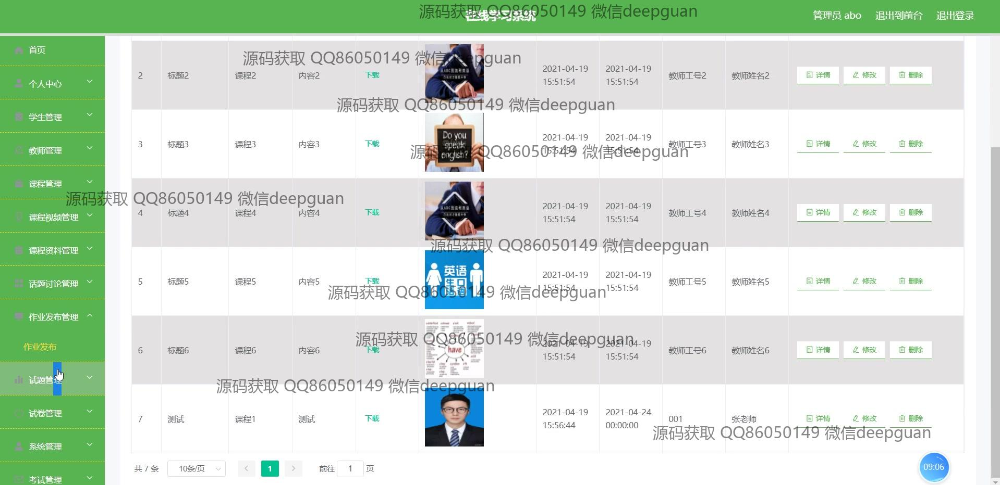

<h1 align="center">基于SSM的在线学习系统的设计与实现</h1>

## 简介
在线学习系统：角色分为管理员、教师、学生；功能包括课程管理、作业发布、试题管理、课程视频播放、讨论互动、个人信息管理。    --计算机毕业设计源码；毕设源码；java毕业设计源码

## 联系方式

<h3 align="center">获取完整代码与数据库文件 + 微信：deepguan QQ: 86050149 QQ群: 783742310</h3>

<h3 align="center">可帮忙远程部署 包运行成功！提供远程部署、修改代码、设计文档指导、代码讲解等服务！</h3>

## 功能介绍（完整见运行截图）
管理员：主要功能包括用户登录、注册和退出。可以通过导航菜单管理学生信息、教师信息和课程资料，进行课程分类与上传，设置和管理试题与试卷，同时拥有资源上传、课程封面设置和系统公告发布权限。

教师：支持登录后管理个人资料、课程视频、课程资料和学生作业，能够发布或编辑课程内容、创建试题与试卷、发布作业、批改作业，并可与学生在话题讨论区互动。

学生：具备注册、登录功能，可查看课程视频、下载课程资料、完成作业提交，参与在线考试，浏览考试记录与错题本，以及在个人中心修改个人信息或收藏内容。

访客：可浏览系统课程列表、课程详情和相关公告，部分页面提供搜索功能，同时可通过注册成为用户以获取更多功能访问权限。

## 运行截图

本代码来源于网络,仅供学习参考使用!

